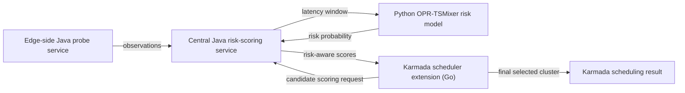

# Scheduler Integration

This directory documents the scheduler-side integration used by the
risk-aware scheduling experiments.

The implementation is a cross-language control path rather than a standalone
Karmada plugin package. In the experimental testbed, the Karmada scheduling
path was modified so that scheduling-time candidate scoring can query an
external risk-aware scoring service.

## Runtime Components

The scheduling chain contains four components:

1. Karmada scheduler extension in Go

   The Karmada scheduling path obtains the native resource-feasible candidate
   clusters and calls the Java risk-scoring service during scheduling. The Go
   side consumes the returned candidate scores and uses them in the final
   ranking decision.

2. Edge-side Java probe service

   A Java service runs on the edge/testbed side to collect cross-cluster
   network observations. These observations are aggregated into
   member-cluster-level latency/risk observations, maintained as a
   `latencyWindow`, and reported to the central risk service.

3. Central Java risk-scoring service

   The central Java service receives recent observations from the edge-side
   service, maintains the latest candidate-level observation state, calls the
   Python OPR-TSMixer risk-prediction model, and converts the returned risk
   probabilities into scheduler-consumable scores.

4. Python OPR-TSMixer risk-prediction model

   The trained Python model receives recent member-cluster-level observation
   windows and returns the short-term placement-risk probability for each
   candidate member cluster.

## Control Flow



## Candidate Scoring Interface

The scheduler-side request contains the candidate member clusters and their
native scheduling context. The risk-scoring service returns a score for each
candidate. Conceptually, the Java service uses:

```text
candidate cluster -> latency window -> OPR-TSMixer risk probability -> risk-aware score
```

The score returned to the Go scheduling path is then used to suppress or
downgrade candidates with high predicted short-term placement risk.

## Artifact Scope

This repository releases the data, model-training code, Python inference
service, selected Java scheduler-service integration code, evaluation results,
and the controlled perturbation utility needed to inspect the reported
experiments. Deployment-specific credentials, cluster-local wiring, and
environment assumptions are excluded.

The algorithmic behavior used by the scheduler is documented in the paper and
is reflected in:

- `training_scripts/`: risk model training and evaluation.
- `inference_service/`: Python OPR-TSMixer inference service.
- `scheduler-plugin/java-services/`: selected Java-side integration code for
  latency-window reporting, Python inference invocation, and risk-aware scoring.
- `data/window_samples/`: supervised samples used to train/evaluate risk
  probabilities.
- `results/tables/figure4_selection_counts.csv`: placement changes after
  risk-aware scheduling.
- `results/tables/table9_end_to_end_performance.csv`: end-to-end service
  performance under ROS, SNS, and RAS.
